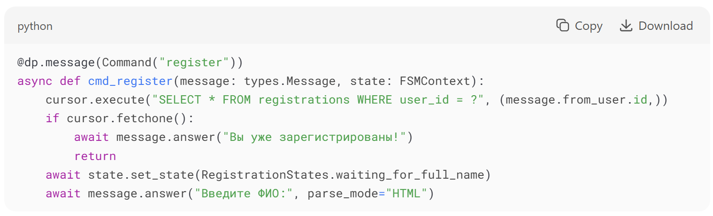
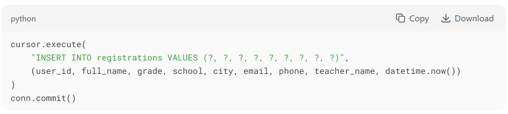

<h1 align="left">Техническое руководство по созданию телеграмм – бота олимпиады «Финатлон»</h1>

<h2 align="left">Введение</h2>
Telegram-бот для олимпиады "Финатлон" предназначен для автоматизации регистрации участников, предоставления информации о мероприятии и хранения данных в базе SQLite.
Технологии: Python, aiogram (3.0.0b7), SQLite, FSM (Finite State Machine).

<h2 align="left">Архитектура проекта</h2>
<h3 align="left">Компоненты системы</h3>

<h3 align="left">UML-диаграмма состояний (регистрация)</h3>

<h2 align="left">Настройка окружения</h2>
<h3 align="left">Требования</h3>
•	Python 3.9+  
•	Библиотеки (см. requirements.txt): 

<h3 align="left">Инструкция по запуску</h3>
1.	Создайте виртуальное окружение:  
 
2.	Установите зависимости:  
 
3.	Получите токен бота у @BotFather и замените YOUR_BOT_TOKEN в коде. 
4.	Запустите бота: 
 

<h2 align="left">Реализация функционала</h2>
<h3 align="left">Команды бота</h3>

| Команда | Описание | 
|:------------:|:----:|:----------:| :------:|
| /start |	Приветственное сообщение |
| /register |	Начать регистрацию |
| /my_data |	Просмотр своих данных |
| /cancel |	Отмена регистрации |
| /info |	Информация об олимпиаде |

<h3 align="left">База данных</h3>
Структура таблицы регистрации: 

<h3 align="left">Валидация данных</h3>
•	ФИО: Проверка на минимальное количество слов (≥2). 
•	Email: Регулярное выражение r"[^@]+@[^@]+\.[^@]+". 
•	Телефон: Формат +7XXXXXXXXXX. 
•	Класс: Только значения 8–11. 

<h2 align="left">Примеры кода</h2>
<h3 align="left">Обработчик регистрации</h3>

<h3 align="left">Сохранение данных в SQLite</h3>

<h2 align="left">Визуализация данных</h2>
<h3 align="left">Схема взаимодействия с пользователем</h3>

<h3 align="left">Пример интерфейса</h3>

<h2 align="left">Развёртывание</h2>
<h3 align="left">Рекомендации для продакшена</h3>
•	Используйте PostgreSQL вместо SQLite для масштабирования. 
•	Добавьте обработку ошибок (например, при потере соединения с БД). 
•	Настройте вебхуки для стабильной работы. 

<h3 align="left">Мониторинг</h3>
Логирование настроено через logging: 

<h2 align="left">Заключение</h2>
Бот автоматизирует регистрацию на олимпиаду, снижая нагрузку на организаторов.

<h2 align="left">Авторы</h2>
<h3 align="left">Воробьева Вероника</h3>
<h3 align="left">Шишкина Дарья</h3>
2.05.2025
